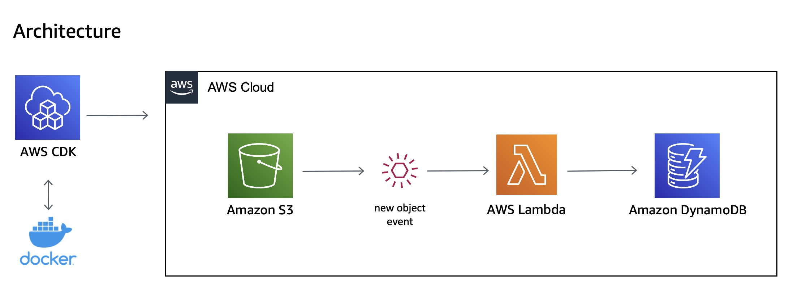

# Building an AWS Lambda Function using the AWS SDK for Swift

This sample application demonstrates using the AWS SDK for Swift in a AWS Lambda function. It uses Docker to compile and package the function into a Docker image. It then uses the AWS Cloud Development Kit (AWS CDK) to deploy the image and create the Lambda function in AWS.

## The Use Case
To illustrate these capabilities, we have a simple use case. The application monitors a Amazon Simple Storage Service (Amazon S3) bucket for new files.  When a user uploads a new file, Amazon S3 sends an event notification to the Lambda function.  The function retrieves metadata about the file and saves it to Amazon DynamoDB.  We will now explore the end-to-end tooling used to develop this application with Swift on AWS.



## Prerequisites

To deploy this application, you need an AWS account and the following tools on your development machine:

* [AWS Command Line Interface (AWS CLI)](https://docs.aws.amazon.com/cli/latest/userguide/install-cliv2.html) (^2.1.32) the AWS CLI is used to configure the AWS credentials on your development machine.
* [Node.js](https://nodejs.org/en/download/current/) (^16.8.0) with NPM (^7.19.1)
* [Typescript](https://www.npmjs.com/package/typescript) (^4.2.4) Typescript is used with the AWS CDK.
* [Docker Desktop](https://www.docker.com/products/docker-desktop) (^3.5.2) The AWS CDK uses Docker to compile the Swift Lambda functions into a Docker image.
* [Swift](https://swift.org/getting-started/#installing-swift) (5.5)

If you are building this sample on a **Mac with Apple Silicon**, make sure you [configure Docker Desktop](https://docs.docker.com/desktop/mac/apple-silicon/) for this chip architecture.

If you are building this sample on a Mac and have Xcode 13.0 installed, you do not need to install Swift 5.5 as you already have it.

When you configure the AWS CLI, use credentials for a user with permissions to create, update, and delete AWS CloudFormation, AWS Identity and Access Management (IAM), Amazon S3, AWS Lambda, Amazon DynamoDB, and Amazon Elastic Container Registry resources. The AWS CDK will use these credentials to create the resources used in this sample in your AWS account.


## Clone this repository

```bash
$ git clone git@github.com:aws-samples/aws-lambda-with-aws-sdk-for-swift.git
```

Swich to the application folder and use the Node Package Manager (npm) to install the required AWS CDK modules.

```bash
$ cd aws-lambda-with-aws-sdk-for-swift
$ npm install
```

## Deploy the application to AWS
If this is the first time you have used the AWS CDK in your AWS account, you must first *bootstrap* your account.

From the **root** folder of your project execute the following command:

```bash
$ npx cdk bootstrap
```

Now you can deploy the application stack.  The deployment step uses Docker on your local machine to build a Docker image from your Lambda code. It then generates a AWS CloudFormation template which defines the Amazon S3 bucket, DynamoDB table, and Lambda function, and deploys it to your account. This process can take several minutes.

```bash
$ npx cdk deploy
```

When the deployment has completed, it will ouput the name of the Amazon S3 bucket, DynamoDB table, and Lambda function that was created. For example:

```bash
Outputs:
AwsServerlessLambdaWithAwsSwiftSdkStack.BucketName = swift-lambda-bucket
AwsServerlessLambdaWithAwsSwiftSdkStack.DynamoDBTableName = swift-lambda-table
AwsServerlessLambdaWithAwsSwiftSdkStack.FunctionName = swift-lambda-function
```

## Run the application
Once the deployment process has completed, logon to the AWS Management Console to view the new resources created in your AWS account.  To test out the application:

- navigate to the Amazon S3 service in the console and locate the Amazon S3 bucket created by the AWS CDK.  
- upload a file to this Amazon S3 bucket
- navigate to the DynamoDB service in the console and select the table created by the AWS CDK

You should see a record in the table that specifies the Amazon S3 bucket, object key, name, and size of the file you uploaded.

## Cleanup

Once you finish using the application, you can remove all the resources created by the AWS CDK with the *destroy* command.

*Note - you must first empty the Amazon S3 Bucket before you run the destroy command otherwise it results in an error. The AWS CDK does not remove buckets that contain objects.*

```bash
$ npx cdk destroy
```
